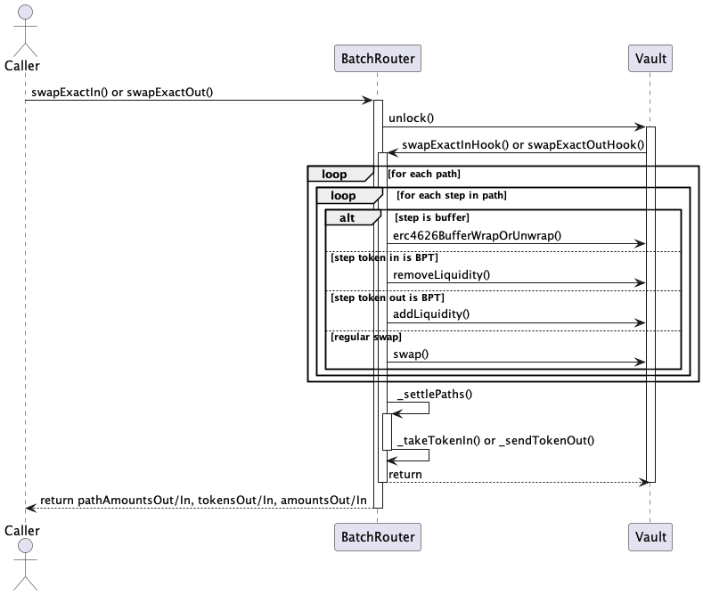

= BatchSwap

*WIP*

== BatchSwap flow (high level)

. Caller invokes either swapExactIn() or swapExactOut() on the BatchRouter contract.
. BatchRouter calls unlock() on the Vault contract.
. Vault calls back into BatchRouter's swapExactInHook() or swapExactOutHook() function.
. BatchRouter iterates over each path and each step within the path:
* If the step is a buffer, it calls erc4626BufferWrapOrUnwrap() on the Vault.
* If the step token in is BPT, it calls removeLiquidity() on the Vault.
* If the step token out is BPT, it calls addLiquidity() on the Vault.
* For a regular swap step, it calls swap() on the Vault.
. After processing all paths and steps, BatchRouter calls _settlePaths() internally to handle token transfers and settlements.
. BatchRouter returns the path amounts, tokens, and amounts (either in or out) to the Vault.
. The Vault returns control back to the BatchRouter.
. BatchRouter returns the path amounts, tokens, and amounts to the caller.

